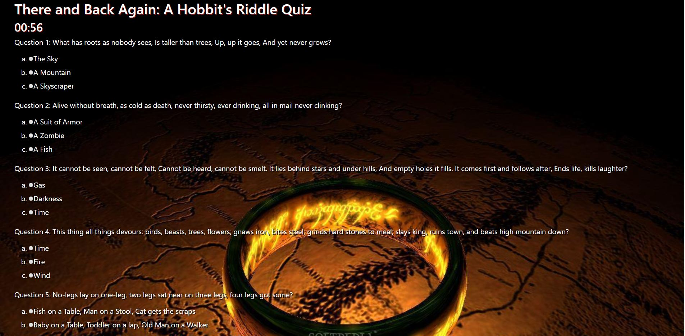

This is a basic trivia game that I designed with the intent of making it as dynamic as possible. The game picks 5 random questions from an array and uses the same last question for a total of 6 questions. 

The questions are all riddles from The Hobbit between Gollum and Bilbo. 

The user has 1 minute to answer each of the 6 questions and then submit them to see their score. If the timer runs out it will end the quiz and tell the user that time has expired. There is a reset button that allows the game to loop and start back again picking 5 new questions at random with out needing to refresh the page.

The biggest challenge for me here was creating everything as dyanmic as possible and utilizing the least amount of coded HTML that I could.

Try it out here: https://cjochen2.github.io/TriviaGame/

